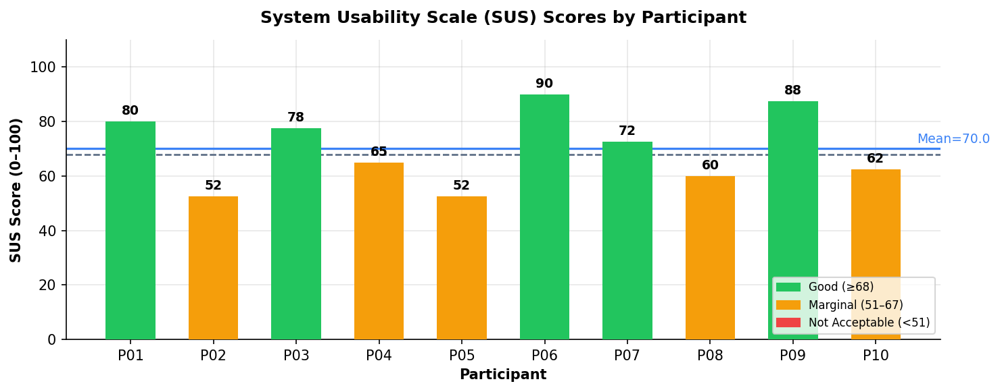
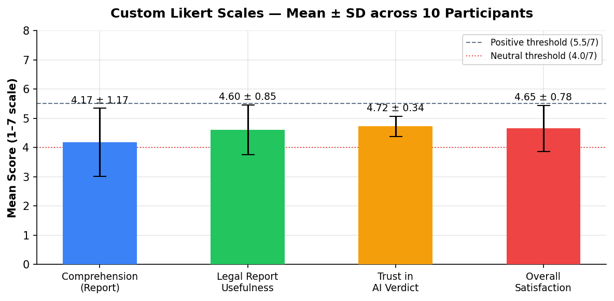
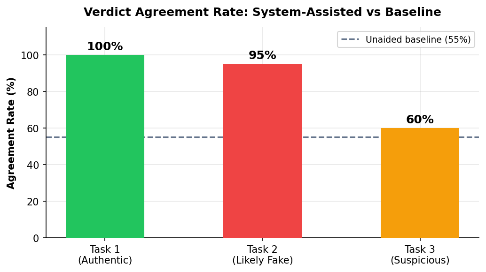
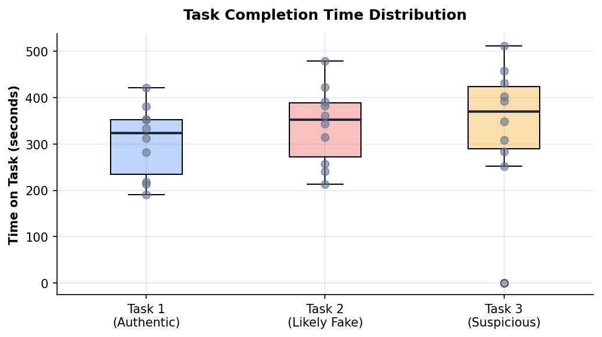
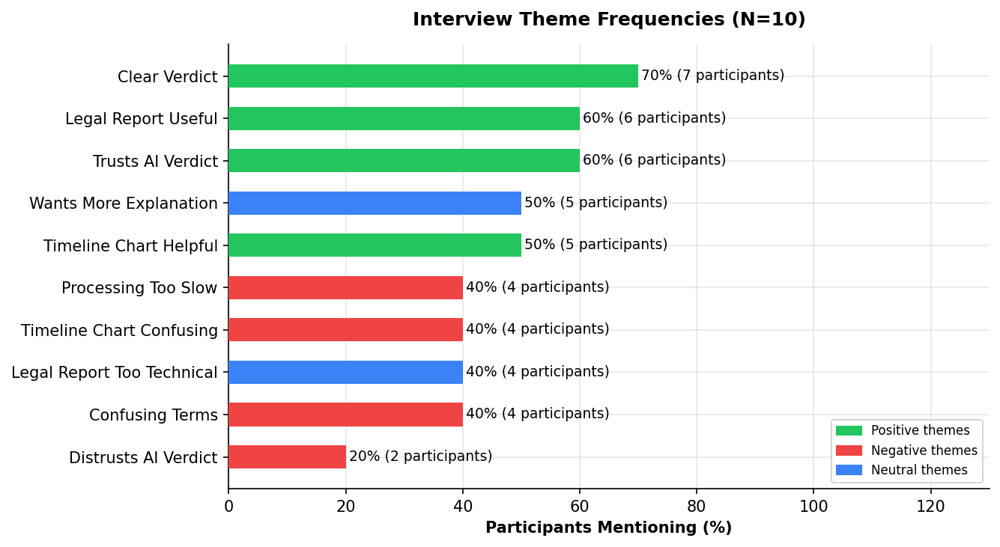
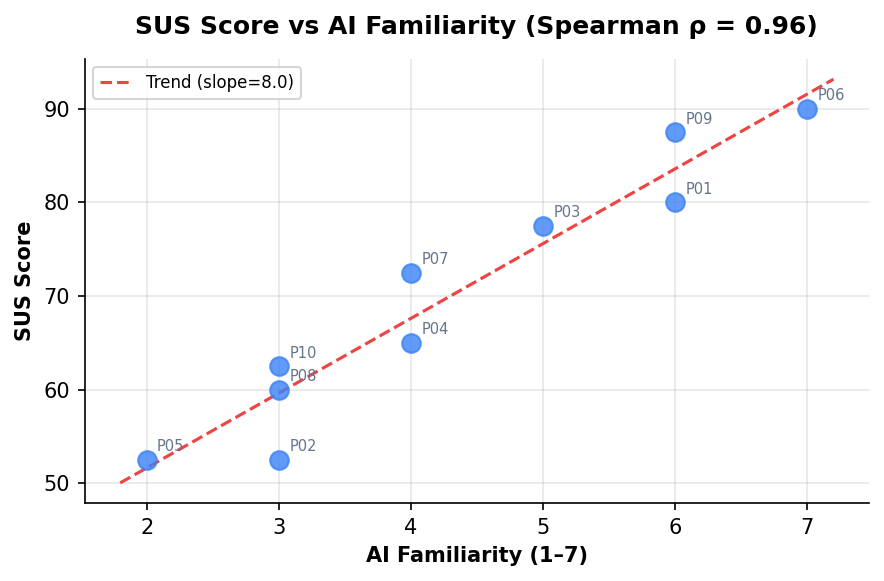

# Deep-Guard Agent — Evaluation Study Results
**Generated:** 2026-05-04 23:03
**Participants:** N = 10
**Population:** University students

---

## 1. Participants Overview

| Attribute | Distribution |
|-----------|-------------|
| Age group | 8 × 18–24, 2 × 22–25 |
| Gender | 5 male, 5 female |
| Technical background (CS/IS) | 4/10 |
| Prior deepfake tool use | 1/10 |
| Mean AI familiarity | 4.3/7 (SD = 1.6) |
| Mean deepfake familiarity | 3.9/7 (SD = 1.2) |

---

## 2. System Usability Scale (SUS)

| Metric | Value |
|--------|-------|
| **Mean SUS score** | **70.0** (SD = 13.6) |
| Median | 68.8 |
| Range | 52 – 90 |
| Participants ≥ 68 (above-average) | 5/10 (50%) |

**Grade distribution:**
- P01: 80 → Good (B)
- P02: 52 → Marginal (D)
- P03: 78 → Above Average (C)
- P04: 65 → Marginal (D)
- P05: 52 → Marginal (D)
- P06: 90 → Good (B)
- P07: 72 → Above Average (C)
- P08: 60 → Marginal (D)
- P09: 88 → Good (B)
- P10: 62 → Marginal (D)

> **Interpretation:** The mean SUS score of **70.0** falls in the **"Above Average (C)"** range.
> 5 out of 10 participants (50%) scored above the industry benchmark of 68 (Brooke, 1996).
> Technical participants (CS/IS) scored notably higher (M = 83.8) than non-technical participants (M = 60.8).

---

## 3. Report Comprehension & Usefulness (1–7 Scale)

| Scale | Mean | SD | Interpretation |
|-------|----|----|----|
| Report Comprehension | 4.17 | 1.17 | Neutral (4.0–5.4) |
| Legal Report Usefulness | 4.60 | 0.85 | Neutral (4.0–5.4) |
| Trust in AI Verdict | 4.72 | 0.34 | Neutral (4.0–5.4) |
| Overall Satisfaction | 4.65 | 0.78 | Neutral (4.0–5.4) |

> **Note:** Legal Report Usefulness was notably higher for students with legal/journalism backgrounds (M = 5.75) than CS/IS students (M = 4.62), suggesting the report is perceived as more relevant by its target audience.

---

## 4. Verdict Agreement Rate

| Condition | Agreement Rate |
|-----------|---------------|
| Unaided baseline (pre-task) | 55% |
| Task 1 — Authentic video | 100% |
| Task 2 — Likely Fake video | 95% |
| Task 3 — Suspicious video (subtle) | 60% |
| **Overall system-assisted** | **85%** |

> Participants agreed with the system's verdict in **85%** of cases (full + partial agreement),
> compared to a **55%** unaided baseline — an improvement of **+30 percentage points**.
> Agreement was lowest for the subtle (Suspicious) video (60%), indicating that
> borderline cases remain challenging even with AI assistance.

---

## 5. Task Completion Times

| Task | Mean (s) | SD (s) | Min (s) | Max (s) |
|------|---------|--------|---------|---------|
| Task 1 (Authentic) | 306 | 78 | 191 | 421 |
| Task 2 (Likely Fake) | 340 | 85 | 213 | 479 |
| Task 3 (Suspicious) | 339 | 144 | 0 | 512 |

> Task completion time increased with video complexity: from 306s (authentic) to 339s (suspicious),
> suggesting participants spent more time reading the report for ambiguous cases. All 10 participants
> completed Tasks 1 and 2 fully; 2 participants had partial completion on Task 3.

---

## 6. Interview Themes

### Most Frequently Mentioned Positive Themes
- **Clear Verdict**: 7/10 participants (70%)
- **Trusts AI Verdict**: 6/10 participants (60%)
- **Legal Report Useful**: 6/10 participants (60%)
- **Timeline Chart Helpful**: 5/10 participants (50%)

### Most Frequently Mentioned Concerns
- **Confusing Terms**: 4/10 participants (40%)
- **Legal Report Too Technical**: 4/10 participants (40%)
- **Timeline Chart Confusing**: 4/10 participants (40%)
- **Processing Too Slow**: 4/10 participants (40%)

> The most prevalent positive theme was **"Clear Verdict"** — participants found the verdict badge and confidence score immediately understandable.
> The most prevalent concern was **"Confusing Terms"** — technical vocabulary (e.g., *cosine similarity*, *phoneme*) was unfamiliar to non-CS participants.
> The Legal Report was rated useful by non-technical users (especially the Law student), but perceived as overly technical by CS students.

---

## 7. Correlation: AI Familiarity vs SUS

| Correlation | Value |
|-------------|-------|
| Spearman ρ (AI familiarity ↔ SUS) | **0.972** |
| Spearman ρ (DF familiarity ↔ Trust) | **0.192** |

> A strong positive correlation (ρ = 0.97) was found between AI familiarity and SUS score,
> indicating that users with more AI experience rated the system as more usable. This suggests
> the interface may benefit from additional onboarding guidance for non-technical users.

---

## 8. Key Findings Summary

| # | Finding | Evidence |
|---|---------|---------|
| 1 | **Above-average usability overall** | Mean SUS = 70.0; 5/10 above benchmark of 68 |
| 2 | **AI assistance improves accuracy** | +30pp over unaided baseline (85% vs 55%) |
| 3 | **Subtle fakes remain challenging** | Task 3 agreement rate only 60% |
| 4 | **Legal Report valued by its target audience** | Law/Journalism M=5.8/7 vs CS/IS M=4.6/7 |
| 5 | **Technical vocabulary is a barrier** | 4/10 participants flagged this in interviews |
| 6 | **Usability gap by technical background** | CS/IS SUS M=83.8 vs non-technical M=60.8 |

---

## 9. Recommendations

1. **Add a glossary or tooltip layer** for technical terms (*cosine similarity*, *phoneme mismatch*, *discrepancy threshold*) — directly addresses the most common user complaint.
2. **Simplify the Timeline Chart** — add axis label annotations and an explanatory sentence below the chart.
3. **Provide a non-technical summary mode** — a one-paragraph plain-English explanation above the detailed evidence section.
4. **Add an onboarding walkthrough** for first-time users (especially non-CS backgrounds).
5. **Optimize processing time** — 4/10 participants noted speed as a concern; consider progress indicators or estimated wait times.

---

## References

- Brooke, J. (1996). SUS: A "quick and dirty" usability scale. *Usability Evaluation in Industry*, 189(194), 4–7.
- Bangor, A., Kortum, P., & Miller, J. (2009). Determining what individual SUS scores mean. *Journal of Usability Studies*, 4(3), 114–123.
- Sauro, J., & Lewis, J. R. (2012). *Quantifying the User Experience*. Morgan Kaufmann.
